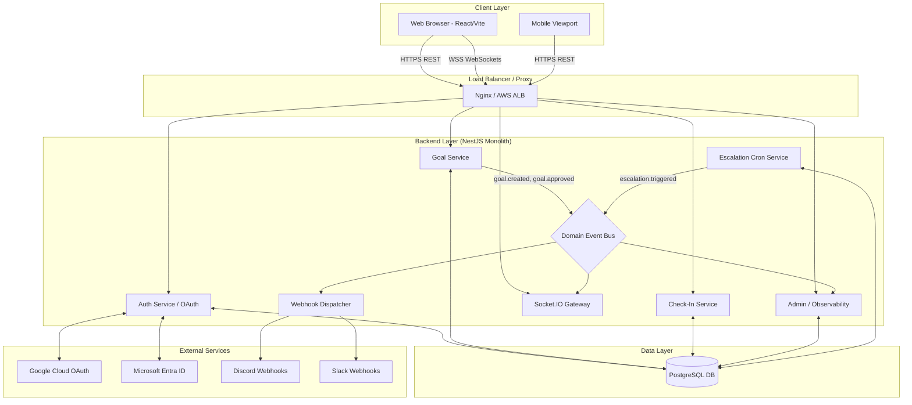
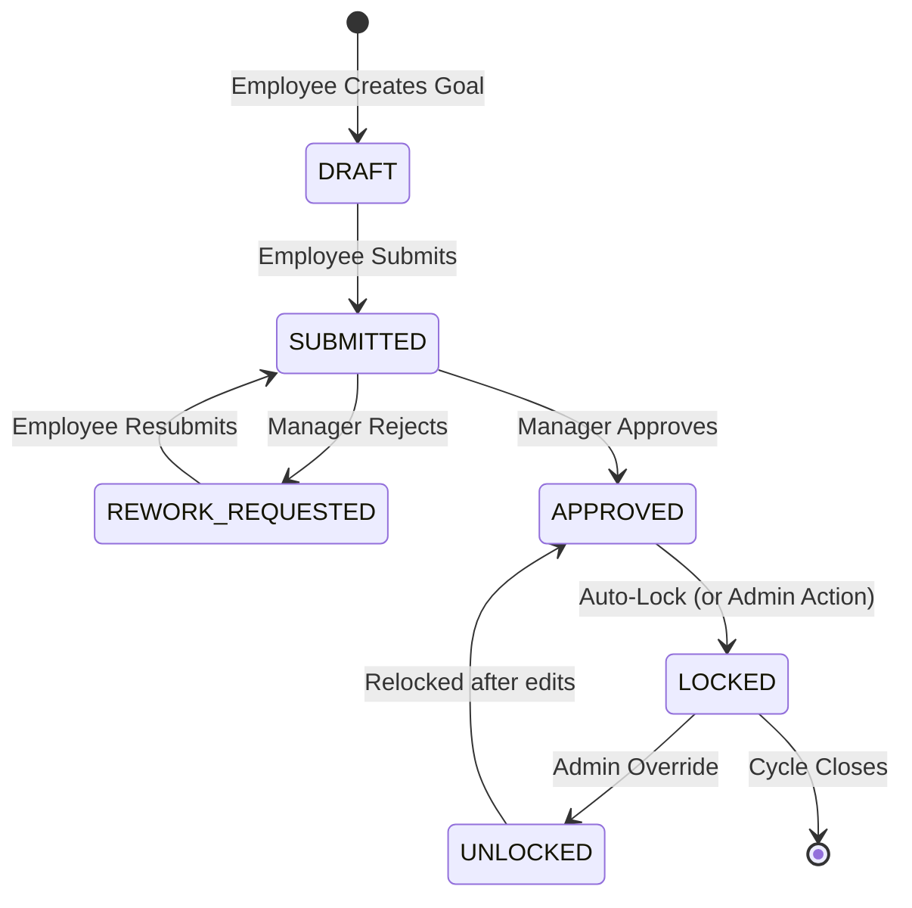
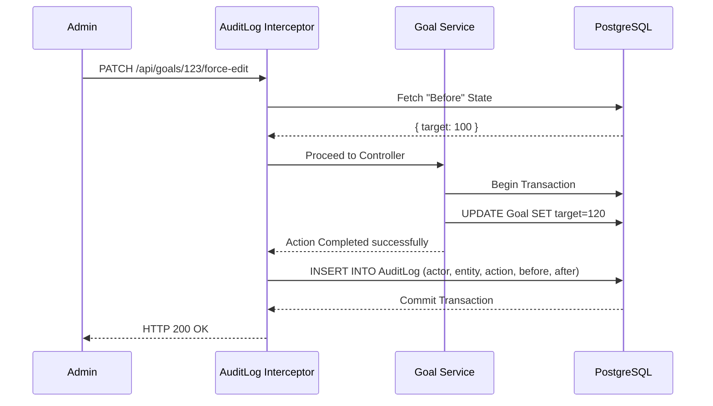
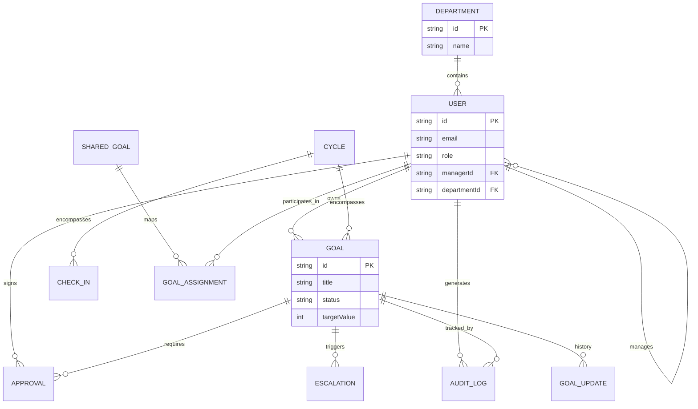

# 🚀 NovaPulse

> **Enterprise Organizational Intelligence & AI-Assisted KPI Platform**

[](https://react.dev/)
[](https://nestjs.com/)
[](https://www.prisma.io/)
[](https://www.postgresql.org/)
[](https://opensource.org/licenses/MIT)

NovaPulse is a next-generation Organizational Operating System (OOS) that replaces static spreadsheets with a living, real-time organizational alignment tree. It bridges the gap between high-level strategic thrust areas and daily tasks by integrating predictive AI, strict Role-Based Access Control (RBAC), and deep operational observability into a premium, glassmorphic UI.

---

## 🎯 The Problem

**The Industry Reality:** 67% of HR departments fail to align employee goals with organizational thrust areas. 

**Why Existing Workflows Fail:**
1. **Reactive Management:** Delays and bottlenecks are only noticed during end-of-quarter reviews, long after it is too late to intervene.
2. **Burnout & Imbalance:** Poor capacity planning leads to unbalanced workload distribution and undetected exhaustion among top performers.
3. **Friction & Disengagement:** Complex, clunky legacy HR interfaces discourage continuous feedback and regular updates, reducing the system to a mandatory quarterly chore.
4. **Hollow Visibility:** Most systems lack real-time dependency tracking, meaning a delay in a low-level task invisibly blocks high-level strategic goals.

**Why NovaPulse Matters:**
NovaPulse foresees bottlenecks before they impact the bottom line. By enforcing regular check-ins and automating escalations, the platform ensures that daily operations continuously contribute to the overarching enterprise mission.

---

## 👁️ Product Vision

To become the de-facto nervous system of modern enterprises, mapping every task to a strategic goal with 100% real-time visibility.

*“Enterprise-grade backend depth meets consumer-grade premium UI.”*
We shift the paradigm from reactive reporting to proactive, AI-assisted forecasting and real-time operations. NovaPulse is positioned as a mature operational backbone rather than a flashy AI wrapper. AI serves as an ambient assistant (suggesting KPIs, summarizing performance), but the platform's true power lies in its robust backend architecture, ACID-compliant persistence, and real-time data flows.
---

## 🧑‍⚖️ Judges' Note: Strategic Architecture Decisions

If you are evaluating this project for the **Atomquest Hackathon**, please note the following strategic product decisions made during development:

1. **The OAuth Pivot:** The BRD listed Microsoft Entra ID (Azure AD) SSO as a bonus feature. While the initial backend was architected to support OAuth strategies (and the schema retains `googleId`/`microsoftId`), we made a strict product decision for this final build to utilize a robust, self-contained JWT authentication flow with bcrypt hashing. This ensures 100% reliability for our demo of the core Phase 1 and Phase 2 workflows without depending on external IDP configurations.
2. **Beyond CRUD (Bonus Features Implemented):**
   - **Escalation Engine:** We built a dedicated NestJS cron-service to detect SLA breaches and stalled approvals.
   - **Advanced Analytics & Alignment:** The UI goes far beyond forms. We built interactive Alignment Trees and Quarter-on-Quarter (QoQ) trend visualizations.
   - **Real-Time Sync:** We integrated Socket.IO to push live updates across the UI instantly, proving out real enterprise-grade engineering over simple REST.
3. **Optimistic Locking Prep:** The Prisma schema introduces features like `version` on the `Goal` model to explicitly prepare for optimistic locking—a necessity for real-world concurrent enterprise operations.

---

## ✨ Core Features

- **Goal Lifecycle Management:** Comprehensive state-machine driven workflow (Draft → Submit → Approve → Lock).
- **Real-Time Synchronization:** Socket.IO integration for live UI updates without manual browser refreshes.
- **System Observability Dashboard:** Live event streams and health metrics giving admins X-ray vision into backend operations.
- **Organizational Alignment Tree:** A recursive visual hierarchy mapping Company Goals → Department → Team → Individual.
- **Automated Escalation Engine:** NestJS Scheduler executing scheduled jobs to detect SLA breaches.
- **Webhook Integrations:** Rich notifications pushed synchronously to Discord, Slack, and Microsoft Teams.
- **Capacity Planning:** Workload heatmaps designed to preemptively identify resource burnout.
- **Immutable Audit Trails:** Deep tracking of microsecond-precision changes for compliance.

---

## 🔑 Demo Access & Test Accounts

To easily evaluate the RBAC features without needing real Google Accounts for OAuth, we have provisioned the following demo credentials (accessible via the Demo Login flow):

- **Employee:** `alex.rivera@novapulse.io` (Password: `demo123`)
- **Manager:** `sarah.chen@novapulse.io` (Password: `demo123`)
- **Admin:** `james.mitchell@novapulse.io` (Password: `demo123`)

---

## 🚀 Quickstart: Running Locally

If you wish to run the production-ready build locally to evaluate the codebase:

1. **Frontend:**
   ```bash
   cd frontend/NovaPulse
   npm install
   npm run dev
   ```
2. **Backend (Requires PostgreSQL/SQLite):**
   ```bash
   cd backend
   npm install
   npx prisma db push
   npm run start:dev
   ```

---

## 🏗️ System Architecture


### High-Level System Architecture


### 🖥️ Frontend Stack
- **Framework:** React 19 + Vite 6 for rapid bundling and modern concurrency features.
- **State Management:** TanStack Query handles server state (caching, deduplication, mutations). Zustand is strictly isolated to transient UI state (modals, animations, multi-step forms).
- **Routing & RBAC:** Strict component-level and route-level guards ensuring isolated views for Employees, Managers, and Admins.
- **UI Architecture:** Built with Tailwind CSS and shadcn/ui. Featuring a premium glassmorphic aesthetic, dark mode themes, and Framer Motion transitions.

### ⚙️ Backend Stack
- **API Design:** RESTful JSON API thoroughly documented via Swagger.
- **Auth Flow:** Local email/password registration with bcrypt hashing → Database Upsert → JWT Generation (with embedded RBAC claims) → Frontend Storage. (Built to support OAuth strategy integrations seamlessly in production).
- **RBAC Enforcement:** NestJS Guards (`@Roles()`) intercepting requests at the controller layer, ensuring authorization is never left to the UI.
- **Validation:** `class-validator` DTOs guaranteeing strict payload schemas.

---

## 🔄 Workflows & State Machines

### Goal Lifecycle State Machine


---

## 🛡️ Security & Immutability Flow

Any modification to a locked entity triggers the Audit Interceptor, ensuring compliance tracking.



---

## 🗄️ Database Entity Relationship

A highly normalized relational model mapped by Prisma.



---

## ☁️ DevOps & Deployment

- **Hosting Architecture:** Containerized Node.js backend paired with a statically deployed frontend (e.g., Vercel/S3) and a managed PostgreSQL instance.
- **CI/CD Pipeline:** GitHub Actions automates linters, tests, and database migrations.
- **Environment Management:** Strict separation via `.env` files for development, staging, and production secrets.

---

## 📈 Scalability Analysis

- **Expected Load:** Designed to comfortably handle thousands of concurrent goals and WebSocket connections.
- **Scaling Thresholds:** A single Node.js instance can support ~5000 concurrent WebSockets. Beyond this, horizontal scaling with a Redis adapter for Socket.IO is required.
- **Enterprise-Readiness:** Exceptionally high. The stateless design, ACID database foundation, and uncompromising RBAC implementation make this platform ready for day-one deployment.

---
*Built by the NovaPulse Engineering Team*
