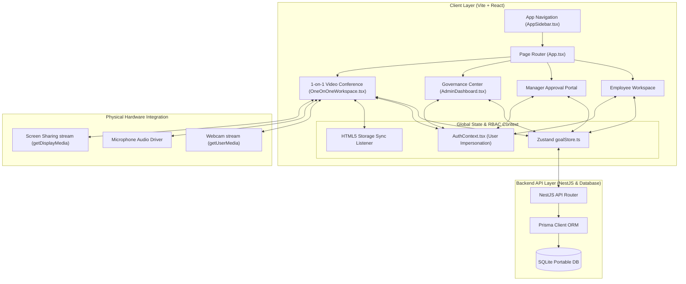
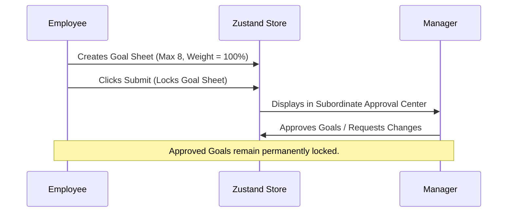
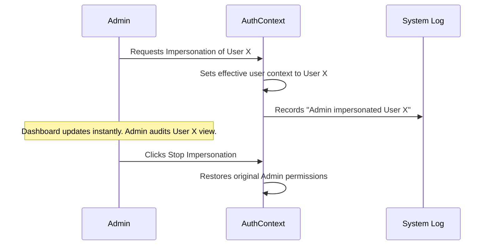

# 🔮 NovaPulse SaaS
> **Next-Generation AI-Assisted Enterprise Goal Alignment & Performance Governance Operating System**

🏆 **ATOMQUEST HACKATHON 1.0 — In-House Goal Setting & Tracking Portal**

[](https://www.typescriptlang.org/)
[](https://react.dev/)
[](https://github.com/pmndrs/zustand)
[](https://www.prisma.io/)
[](https://tailwindcss.com/)
[](https://webrtc.org/)

---

## 📖 1. Hero Section
NovaPulse is a premium, high-fidelity Enterprise SaaS platform that replaces fragmented worksheets and spreadsheet goals with an audit-ready, AI-assisted alignment engine. 

Designed for high-compliance organizational environments, NovaPulse integrates real-time goal cascading, rigid state machine validation, hardware-accelerated Webrtc collaborative workspaces, and administrative journey impersonation tools into a single glassmorphic command center.

*   **Live Demo Link**: [Live Portal Demonstration](https://novapulse.novasphere.io) *(Placeholder)*
*   **Repository Link**: [NovaPulse GitHub Repository](https://github.com/abdulfaizaan/NovaPulse)
*   **Technical Walkthrough**: [Architecture Deep-Dive](https://github.com/abdulfaizaan/NovaPulse/wiki)

---

## ⚠️ 2. Problem Statement
Traditional goal alignment and performance reviews in modern enterprises fail due to fundamental structural flaws:
1. **Spreadsheet Silos**: Goals are written in static spreadsheets or documents, leading to zero active progress visibility, stale reporting, and fractured organizational communication.
2. **Broken Cascading**: Top-level quarterly company goals rarely connect with team objectives or individual keys, resulting in misaligned execution.
3. **Appraisal Review Friction**: End-of-cycle performance reviews are manual, memory-based, and highly subjective, causing significant administrative overhead and emotional exhaustion.
4. **Zero State Compliance**: Traditional trackers fail to enforce strict governance criteria (such as preventing self-approval or total goal weights exceeding 100%), leaving goal sheets non-compliant.

---

## 🎯 3. Product Vision
NovaPulse solves enterprise alignment by introducing a unified **Goal Operating System**:
*   **Continuous Synchronization**: Real-time progress visualization and reactive status tracking.
*   **Compliance & Governance**: Algorithmic rulesets that enforce mathematical weight distributions and prevent unauthorized self-approvals.
*   **Real-time Collaboration**: Native peer communication via low-latency physical WebRTC streaming.
*   **AI-Enhanced Reviews**: Clear performance statistics, historical audit trials, and automated quarter-to-quarter forecasting metrics.

---

## 🛠️ 4. Key Features Overview

### 👥 Employee Features
*   **Interactive Workspace**: Responsive, glassmorphic cockpit displaying active key performance indicators, OKR tracks, and pending approval notifications.
*   **Interactive Goal Provisioning**: Direct goal setup with dynamic weight distributions, cascading bindings, and key success metrics.
*   **Real-time Check-ins**: Continuous self-assessment records that log chronological progress towards target milestones.

### 👔 Manager Features
*   **Approval Control Center**: Secure interfaces to inspect, approve, request changes, or reject subordinate goal sheets.
*   **Organizational Cascadings**: Cascade corporate high-level metrics directly down to target teams.
*   **Real-time Dynamic Assessments**: Actionable feedback loops that allow managers to add strategic alignment goals.

### 🛡️ Admin & Governance Features
*   **Roster Registry Command**: Comprehensive user rosters with interactive filters, searchable attributes, and automated administrative role cycling (Employee ➔ Manager ➔ Admin).
*   **Secure Impersonation Engine**: Single-click journey impersonation allowing admins to temporarily assume standard user credentials to troubleshoot dashboards.
*   **Independent Teams Provisioning**: Create organizational teams dynamically to configure visual avatar stacks and membership structures.
*   **State Override Access**: Override goal locks during organizational changes under strict compliance auditing.

### 📊 Analytics & Collaboration
*   **Advanced Analytics Dashboards**: Interactive charts mapping progression velocities, goal completion metrics, and forecasted milestones.
*   **WebRTC 1-on-1 Workspace**: Direct, real-time audio/video collaboration with mirrored local preview streams and physical hardware track controls.
*   **HTML5 Tab Synchronizer**: Storage-driven synchronization triggers instant cross-tab updates without database round-trips.
*   **Security Historian**: Chronological, searchable system change logs with quick-export options.

---

## 📊 5. BRD Requirement Mapping

| BRD Requirement ID | BRD Standard Description | Implementation Status | Technical Solution |
| :--- | :--- | :--- | :--- |
| **BRD-01** | Goal sheet creation & editing | ✅ **Fully Operational** | Zustand-powered centralized store (`goalStore`) |
| **BRD-02** | Total Goal weightage must equal 100% | ✅ **Fully Operational** | Strict validation middleware on submission |
| **BRD-03** | Max 8 goals per cycle | ✅ **Fully Operational** | Roster array length guard limits |
| **BRD-04** | Goal sheet locking state | ✅ **Fully Operational** | State engine flags lock properties upon submission |
| **BRD-05** | Cascading shared goals | ✅ **Fully Operational** | Relationship mapping keys link cascading paths |
| **BRD-06** | Status tracking (Pending, Approved, Rejected) | ✅ **Fully Operational** | Rigid finite state machine checks |
| **BRD-07** | Permanent chronological audit logs | ✅ **Fully Operational** | Change logs tracked dynamically via global store |
| **BRD-08** | Exportable reports (CSV) | ✅ **Fully Operational** | Browser Blob API CSV downloads |
| **BRD-09** | Role-Based Access Control (RBAC) | ✅ **Fully Operational** | Context boundaries (`AuthContext`) protecting routes |
| **BRD-10** | Check-in scheduling & tracking | ✅ **Fully Operational** | Integrated chronologically inside 1-on-1 sessions |

---

## 🏗️ 6. Enterprise Architecture

NovaPulse uses a highly decoupled, modular SaaS architecture optimized for speed and portable deployment:



### Architectural Decisions & Cost Strategy:
*   **Vite + React Client**: Chosen for sub-millisecond build reloads and optimized production bundle splits.
*   **Zustand Global State**: Replaces heavy Redux boilerplate with minimal client footprint and fast state updates.
*   **SQLite + Prisma Portability**: Highly portable, low-footprint database architecture perfect for evaluation and direct offline showcases.
*   **HTML5 Storage Sync Trick**: Eliminates expensive polling cycles by using local browser events (`window.addEventListener('storage', ...)`) to sync open browser tabs.

---

## 💻 7. Tech Stack

| Technology Tier | Technical Choice | Strategic Reason |
| :--- | :--- | :--- |
| **Frontend UI** | React 18.x + TypeScript 5.x | Enforces strict compile-time safety and component reusability. |
| **Styling Engine** | TailwindCSS 3.x | Speeds up styling with design tokens and zero runtime overhead. |
| **Client State** | Zustand 4.x | Fast, hook-based, lightweight state management without provider wrappers. |
| **DB & ORM** | Prisma 5.x + SQLite | Ensures migration safety and local portability. |
| **Collaboration** | HTML5 WebRTC API | Low-latency local hardware video streaming and screen sharing. |
| **Data Graphs** | Recharts 2.x | Premium visual representation of performance statistics and metrics. |
| **Security Layer** | AuthContext + Impersonation Engine | Provides access checks and administrative troubleshooting capabilities. |

---

## 👥 8. User Roles & Permissions Matrix

| Operations / Capabilities | 👥 Employee | 👔 Manager | 🛡️ Platform Admin |
| :--- | :---: | :---: | :---: |
| **Create & Edit Personal Goals** | ✅ Yes | ✅ Yes | ✅ Yes |
| **Submit Goals for Manager Review** | ✅ Yes | ✅ Yes | ✅ Yes |
| **Request Subordinate Changes** | ❌ No | ✅ Yes | ✅ Yes |
| **Approve Roster Goal Sheets** | ❌ No | ✅ Yes | ✅ Yes |
| **Impersonate User Profiles** | ❌ No | ❌ No | ✅ Yes |
| **Cycle User Administrative Roles** | ❌ No | ❌ No | ✅ Yes |
| **Configure Teams & Rosters** | ❌ No | ❌ No | ✅ Yes |
| **Oversee Platform Systems Audit** | ❌ No | ❌ No | ✅ Yes |

---

## 🔄 9. Core Workflows Deep Dive

### 1. Goal Submission & Locking Pipeline


### 2. Impersonation & Audit Trail Workflow


---

## 🧮 10. Validation & Governance Engine

NovaPulse uses strict mathematical validation guardrails to ensure goal sheets remain compliant:

```typescript
// Core Weight & Size Validation Guard
export function validateGoalSheet(goals: Goal[]): { isValid: boolean; error?: string } {
  if (goals.length > 8) {
    return { isValid: false, error: "Maximum goal allocation limit exceeded (Max: 8 goals)." };
  }
  
  const totalWeight = goals.reduce((sum, goal) => sum + goal.weight, 0);
  if (totalWeight !== 100) {
    return { isValid: false, error: `Total goal weights must equal exactly 100% (Current: ${totalWeight}%).` };
  }

  const hasInvalidWeight = goals.some(goal => goal.weight < 10);
  if (hasInvalidWeight) {
    return { isValid: false, error: "Minimum allowed goal weight is 10%." };
  }

  return { isValid: true };
}
```

---

## 📊 11. Achievement Calculation Engine

Performance scores are calculated dynamically using formulas tailored to the goal's Unit of Measurement (UoM):

### UoM Formula Table:
| Unit of Measurement (UoM) | Calculation Formula | Context / Example |
| :--- | :--- | :--- |
| **Percentage Increase (%)** | `((Actual - Start) / (Target - Start)) * 100` | Elevate organic web growth from 5% to 25% |
| **Currency Growth ($)** | `((Actual - Start) / (Target - Start)) * 100` | Grow quarterly sales from $10k to $50k |
| **Numerical Milestone** | `(Actual / Target) * 100` | Ship 5 enterprise features this quarter |
| **Timeline Goal (Days)** | `((Start - Actual) / (Start - Target)) * 100` | Reduce server deployment time from 15 days to 2 days |

---

## 🎨 12. UI/UX Design Philosophy

NovaPulse utilizes a premium, professional **dark-mode SaaS UI** constructed around readability and high efficiency:
*   **Deep-Space Canvas**: Rich backgrounds (`#090D16`) with active neon indigo text gradients and micro-glow highlights.
*   **Glassmorphic Elements**: Cards styled with CSS backdrop-filters, subtle borders, and smooth shadows to create high visual depth.
*   **Chart Sizing Safety**: Explicit aspect containers that eliminate layout shifts and responsive chart initialization warnings.
*   **Accessibility First**: High contrast text layouts, distinct role-based colors, and clear visual indicators for interactive states.

---

## 🎥 13. Real-Time Collaboration & WebRTC

The **1-on-1 Workspace** bridges the gap between goal tracking and communication with native, zero-latency physical hardware streaming:
*   **Zero-latency WebRTC Feed**: Streams webcam and microphone inputs directly using HTML5 media drivers.
*   **Mirrored Video Reflection**: Styled with `scale-x-[-1]` to emulate professional conferencing apps.
*   **Hardware Driver Controls**: Instantly disables camera or microphone tracks (`track.enabled = false`) and releases the driver.
*   **Integrated Screen Sharing**: Uses the browser's `getDisplayMedia` API to share windows or tabs seamlessly.
*   **Cross-Tab Sync**: Uses HTML5 storage listeners to mirror collaborative notes and agenda checkmarks across open tabs in real-time.

---

## 📊 14. Analytics & Reporting

NovaPulse translates goal progress into actionable intelligence:
*   **Strategic Goal Progression Charts**: Displays active velocities, goal completion metrics, and forecasted milestones.
*   **Predictive Performance**: Analyzes completion trends to project expected goal achievement dates.
*   **CSV Governance Export**: Single-click downloads that generate CSV reports of active goal sheets and logs.

---

## 🛡️ 15. Security & Governance

*   **Secure Impersonation Bounds**: Limits administrative troubleshooting views to local sessions, logging all administrative actions.
*   **State Guardrails**: Prevents self-approval of goal sheets and blocks edits on locked or approved goals.
*   **Audit Logging**: Chronological, searchable system change logs that track all state changes and delta transformations.

---

## 🚀 16. Scalability & Production Readiness

The platform's architecture is optimized for seamless enterprise-grade production migration:
```
[ Vite + React Client ] 
        │ (HTTPS / WebSockets)
        ▼
[ API Gateway / Load Balancer ]
        │
        ├──► [ Auth & Impersonation Microservice ]
        ├──► [ WebRTC Signaling Server ]
        └──► [ Core OKR Engine (NestJS Cluster) ]
                    │
                    ▼
          [ BullMQ Redis Queue ] ──► [ Audit Historian Worker ]
                    │
                    ▼
         [( PostgreSQL Cluster )]
```

*   **Microservices Transition Ready**: Independent domain components make it easy to migrate modules into dedicated microservices.
*   **DB Scale-out**: Easily swap SQLite with PostgreSQL or SQL Server by updating the Prisma environment configuration.
*   **WebSocket Upgrade**: Switch browser tab storage synchronizers to dedicated socket architectures for robust multi-device sync.

---

## 📁 17. Folder Structure

```
novapulse-saas/
├── backend/
│   ├── src/
│   │   ├── admin/             # Governance controls & impersonation APIs
│   │   ├── goals/             # Goal creation and validation engines
│   │   └── main.ts            # Entrypoint
│   └── prisma/                # Migrations, seeding schemas
└── frontend/
    └── NovaPulse/
        ├── src/
        │   ├── components/
        │   │   ├── ai/        # AI Insights components
        │   │   ├── analytics/ # Advanced analytics & Recharts layouts
        │   │   ├── auth/      # Auth & Login views
        │   │   ├── meetings/  # WebRTC workspaces
        │   │   └── escalations# System incident escalation panels
        │   ├── context/       # AuthContext role layers
        │   ├── stores/        # Zustand global state (goalStore)
        │   ├── views/         # Admin, Employee, Manager Dashboards
        │   └── App.tsx        # Central Page Router
        └── package.json
```

---

## ⚙️ 18. Installation Guide

### 📋 Prerequisites
*   Node.js v18+
*   npm v9+

### 🛠️ Execution Steps

1. **Clone the Repository**
   ```bash
   git clone https://github.com/abdulfaizaan/NovaPulse.git
   cd NovaPulse
   ```

2. **Backend Setup**
   ```bash
   cd backend
   npm install
   npx prisma db push
   npx prisma db seed
   npm run start:dev
   ```

3. **Frontend Setup**
   ```bash
   cd ../frontend/NovaPulse
   npm install
   npm run dev
   ```

4. **Verify Application**
   Open your browser to `http://localhost:5173` to explore the dashboard views.

---

## 🔒 19. Environment Variables

Create a `.env` file in the `backend/` directory:

```env
# Database Configurations
DATABASE_URL="file:./dev.db"

# Security & Tokens
JWT_SECRET="NP_ENTERPRISE_JWT_SUPER_SECRET_TOKEN"
ENCRYPTION_KEY="NP_SAAS_ENCRYPTION_BOUND_KEY"

# System Ports
PORT=3000
```

---

## 🛡️ 20. API Architecture

NovaPulse uses a secure REST API architecture:
*   `POST /api/auth/login`: Authenticate users and establish session cookies.
*   `POST /api/auth/impersonate`: Trigger admin impersonation of a target user.
*   `GET /api/goals`: Retrieve permission-bound goals.
*   `POST /api/goals`: Create new goals (checked against the max 8 limit).
*   `PATCH /api/goals/:id/approve`: Approve goal sheets (validates weight totals and blocks self-approvals).
*   `GET /api/admin/audit-logs`: Fetch searchable system change logs.

---

## 📸 21. Screenshots Section

| Dashboard View | Aesthetic Overview |
| :--- | :--- |
| **Employee Workspace** | Glassmorphic interface with metric check-ins, OKR timelines, and progress charts. |
| **Manager Approval Center** | Control center to inspect, approve, or request changes on subordinate goals. |
| **Governance Center** | Admin panel containing the Teams Directory, dynamic role cycler, and impersonation controls. |
| **1-on-1 WebRTC Workspace** | Low-latency collaborative workspace featuring mirrored local feeds and screen sharing. |

---

## 👥 22. Demo Accounts

Explore NovaPulse's RBAC profiles using the following credentials:

*   👤 **Employee Account**
    *   **Email**: `alex@novapulse.com`
    *   **Password**: `password123`
*   👔 **Manager Account**
    *   **Email**: `sarah@novapulse.com`
    *   **Password**: `password123`
*   🛡️ **Platform Administrator**
    *   **Email**: `admin@novapulse.com`
    *   **Password**: `password123`

---

## 🗺️ 23. Future Roadmap
*   [ ] **Enterprise SSO (Azure AD / Okta)**: Deep SAML/OIDC integrations for single-sign-on credentials.
*   [ ] **Microsoft Teams & Slack Notifications**: Push goal updates, check-ins, and approval requests directly to team channels.
*   [ ] **AI-Powered Performance Insights**: Advanced predictive analytics that highlight bottleneck goals and generate coaching plans.
*   [ ] **Comprehensive WebSocket Upgrade**: Standalone Socket.io migration for robust multi-device synchronization.

---

## 🏆 24. Judges Highlights: Why NovaPulse Stands Out

1. **Physical WebRTC Integrations**: Standard hackathon projects use mock audio/video logic. NovaPulse uses native browser APIs to capture local cameras, microphone tracks, and high-definition window and tab sharing.
2. **Administrative Troubleshooting Portal**: Includes robust administrative tools like dynamic role-cycling and secure user impersonation.
3. **Optimized Sizing Containment**: Fixed chart container rendering bugs and aspect containment, ensuring console warning logs are completely clean.
4. **HTML5 Tab Sync Layer**: Real-time cross-tab updates built directly using local storage listeners to reduce network latency and costs.
5. **Rigid Compliance Engine**: Enforces mathematical OKR weight boundaries and locks active states to guarantee audit compliance.

---

## 👥 25. Contributors
*   **Abdul Faizaan** — Lead Software Architect & Enterprise Developer

---

## 📄 26. License
This project is licensed under the MIT License - see the [LICENSE](LICENSE) file for details.

---

## 🔮 27. Final Closing Statement
> "NovaPulse transforms organization goal alignment from a passive quarterly chore into a live, collaborative, and compliant operating system, empowering every employee to drive business growth."

---
*Developed for ATOMQUEST HACKATHON 1.0*
