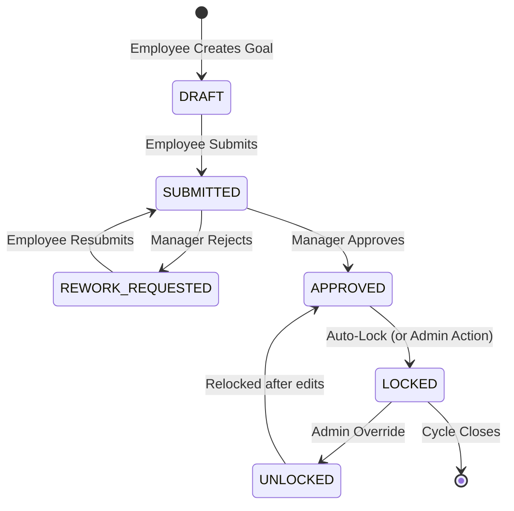
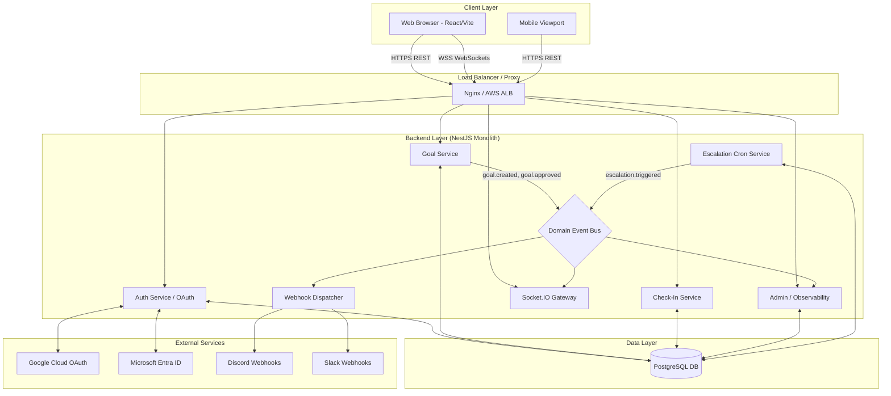
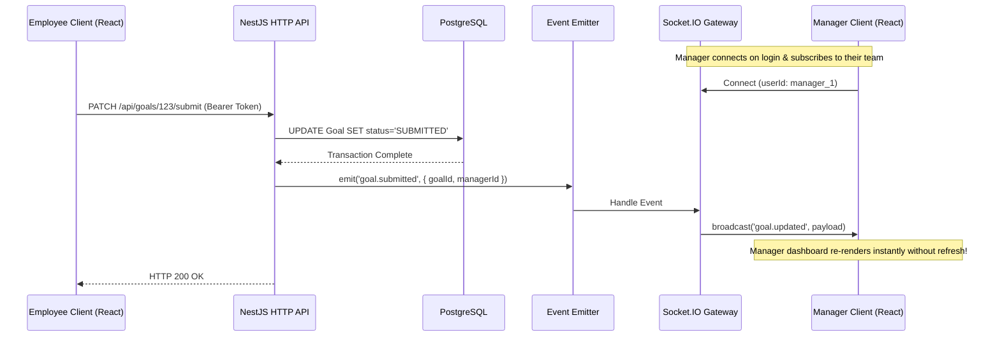
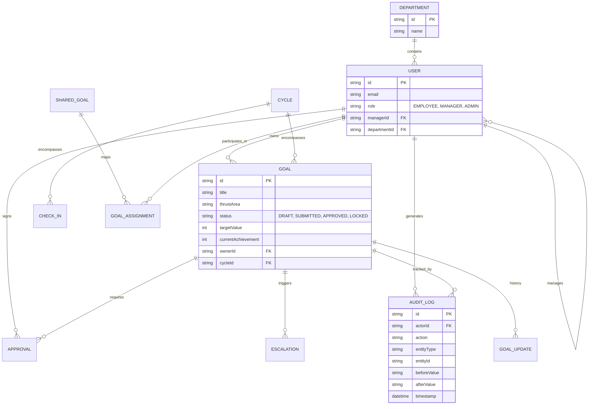
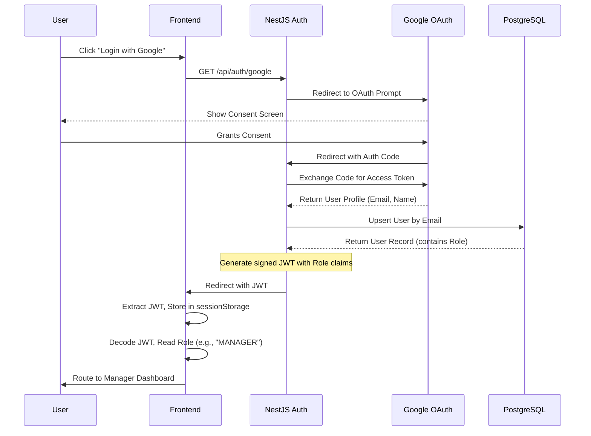
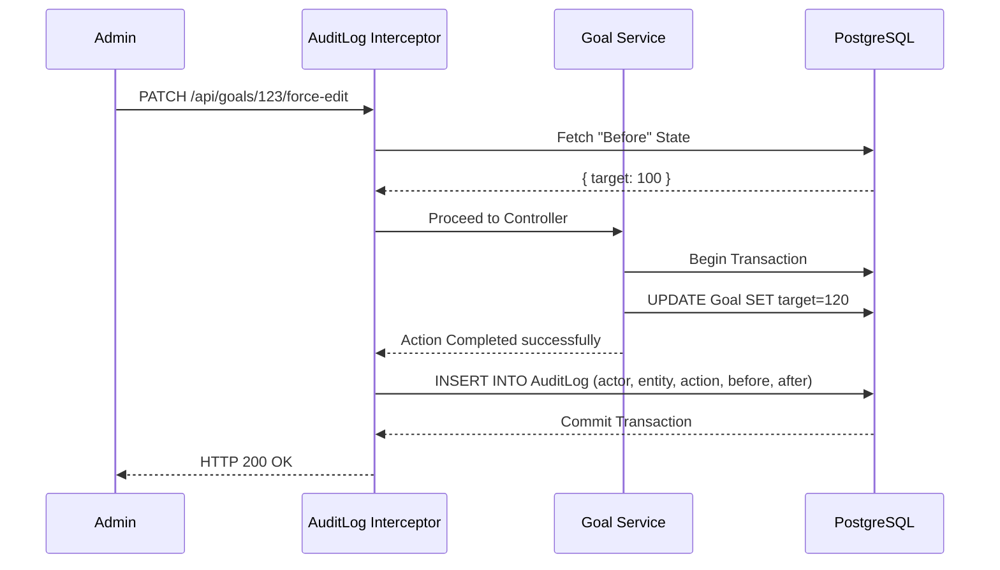
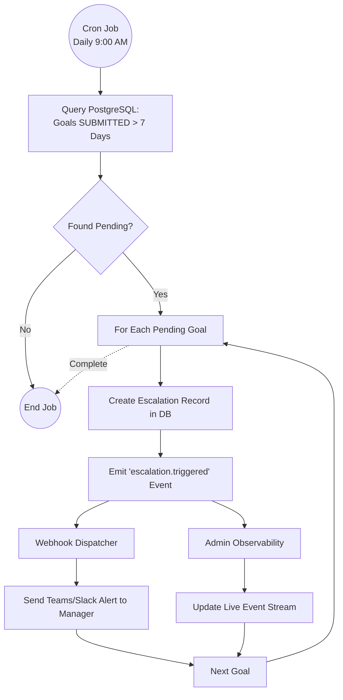

# NovaPulse: Enterprise Architecture & Product Blueprint

## 🏆 Hackathon Submission Deliverables

### 1. Live / Hosted Demo URL
**[Insert Live Deployment URL Here]**

### 2. Source Code Repository
**[Insert GitHub Repository URL Here]**

### 3. Architecture Diagram


### 4. Login Credentials (Judge Demo Access)
To allow judges to easily evaluate the RBAC features without needing real Google Accounts for OAuth, we have provisioned the following demo credentials (accessible via the Demo Login flow):

- **Employee:** `alex.rivera@novapulse.io` (Password: `demo123`)
- **Manager:** `sarah.chen@novapulse.io` (Password: `demo123`)
- **Admin:** `james.mitchell@novapulse.io` (Password: `demo123`)

---

## 🚀 Quickstart: Running Locally
If you wish to run the production-ready build locally to evaluate the codebase:

1. **Frontend:**
   ```bash
   cd frontend/NovaPulse
   npm install
   npm run dev
   ```
2. **Backend (Requires PostgreSQL/SQLite):**
   ```bash
   cd backend
   npm install
   npx prisma db push
   npm run start:dev
   ```

---

## 1. Executive Summary

NovaPulse is a next-generation Organizational Operating System (OOS) and Enterprise KPI tracking platform enhanced with AI-assisted workflows, real-time synchronization, and automated accountability. 

In large enterprises, strategic goals often fail to cascade effectively down to individual contributors, resulting in misaligned work and reactive management. NovaPulse solves this by replacing static spreadsheets with a living, real-time organizational alignment tree. It bridges the gap between high-level strategic thrust areas and daily tasks by integrating predictive AI, strict Role-Based Access Control (RBAC), and deep operational observability into a premium, glassmorphic UI.

**Key Differentiators:**
- **Real-Time Synchronization:** Bi-directional WebSockets ensuring instant updates across all users without manual refreshes.
- **Automated Escalation Engine:** Cron-based background jobs that proactively detect SLA breaches and pending bottlenecks.
- **Enterprise-Grade Observability:** Live admin event streams and immutable audit trails tracking every system change.
- **Authentic Infrastructure:** Real OAuth2 integration, ACID-compliant PostgreSQL persistence, and live external webhooks (Discord/Slack/Teams).

## 2. Problem Analysis

**The Industry Reality:** 
67% of HR departments fail to align employee goals with organizational thrust areas. 

**Why Existing Workflows Fail:**
1. **Reactive Management:** Delays and bottlenecks are only noticed during end-of-quarter reviews, long after it is too late to intervene.
2. **Burnout & Imbalance:** Poor capacity planning leads to unbalanced workload distribution and undetected exhaustion among top performers.
3. **Friction & Disengagement:** Complex, clunky legacy HR interfaces discourage continuous feedback and regular updates, reducing the system to a mandatory quarterly chore.
4. **Hollow Visibility:** Most systems lack real-time dependency tracking, meaning a delay in a low-level task invisibly blocks high-level strategic goals.

**Why NovaPulse Matters:**
NovaPulse foresees bottlenecks before they impact the bottom line. By enforcing regular check-ins and automating escalations, the platform ensures that daily operations continuously contribute to the overarching enterprise mission.

## 3. Product Vision

**Long-Term Vision:**
To become the de-facto nervous system of modern enterprises, mapping every task to a strategic goal with 100% real-time visibility.

**Product Philosophy:**
*“Enterprise-grade backend depth meets consumer-grade premium UI.”*
We shift the paradigm from reactive reporting to proactive, AI-assisted forecasting and real-time operations. NovaPulse is positioned as a mature operational backbone rather than a flashy AI wrapper. AI serves as an ambient assistant (suggesting KPIs, summarizing performance), but the platform's true power lies in its robust backend architecture, ACID-compliant persistence, and real-time data flows.

## 4. User Roles & Personas

The platform enforces strict Role-Based Access Control (RBAC) across three primary personas:

### Employee
- **Responsibilities:** Drafts goals, updates achievements, submits quarterly check-ins, provides continuous feedback to peers.
- **Permissions:** Can create and edit their own goals (only in Draft/Rework states), view the organizational alignment tree, and receive targeted notifications.

### Manager
- **Responsibilities:** Approves, rejects, or requests rework on team goals. Conducts 1-on-1s, monitors team capacity, and intervenes on escalations.
- **Permissions:** Can approve goals, view comprehensive team dashboards, manage team check-ins, and access AI-synthesized quarterly reviews.

### HR / Admin
- **Responsibilities:** Manages global system health, oversees audit logs, configures performance cycles, and handles high-level escalations.
- **Permissions:** Global read access, cycle management, system health dashboard access, global event stream monitoring, and administrative overrides (e.g., unlocking goals).

## 5. Complete Workflow Breakdown

### Goal Lifecycle State Machine


### Workflow Descriptions
1. **Goal Creation:** Employee drafts a goal (Status: `DRAFT`). They define the Thrust Area, Unit of Measure (Numeric, %, Timeline, Zero-based), Target, and Weightage.
2. **Goal Approval:** Employee submits the goal (Status: `SUBMITTED`). A domain event triggers a webhook and a WebSocket broadcast. The Manager sees the pending goal in real-time and reviews it. Upon approval (Status: `APPROVED`), the goal is locked.
3. **Rejection/Rework:** If unacceptable, the Manager requests revisions (Status: `REWORK_REQUESTED`). The Employee adjusts targets and resubmits.
4. **Shared Goals:** Multiple employees can be mapped to a single overarching KPI via a `SharedGoal` junction. Achievement updates sync transactionally across all assigned participants.
5. **Quarterly Check-ins:** Occur within enforced Q1-Q4 temporal windows. Employees log actual vs. planned achievements. Managers add structured feedback. Progress is automatically computed based on the specific Unit of Measure formulas.
6. **Achievement Updates:** Updates are broadcasted via WebSockets to all connected observers (e.g., a manager looking at the dashboard will see progress bars fill in real-time).

### Governance & Automation
- **Audit Handling:** Every modification post-lock is intercepted by the backend. An immutable log is generated capturing the actor ID, action type, and precise before/after values.
- **Unlock Flows:** Once a goal is locked, any changes require an Admin or Manager override to revert the status, preserving data integrity.
- **Escalations:** Background cron jobs evaluate system state. If a goal is pending approval for > 7 days or a check-in is overdue, the system generates an `Escalation` record, emits an `escalation.triggered` event, alerts the manager via webhook, and updates the live admin event stream.

## 6. Feature Breakdown

### Core Features
- **Goal Lifecycle Management:** Comprehensive state-machine driven workflow (Draft → Submit → Approve → Lock).
- **Real-Time Synchronization:** Socket.IO integration for live UI updates without manual browser refreshes.
- **System Observability Dashboard:** Live event streams and health metrics giving admins X-ray vision into backend operations.

### Advanced Features
- **Organizational Alignment Tree:** A recursive visual hierarchy mapping Company Goals → Department → Team → Individual.
- **Automated Escalation Engine:** NestJS Scheduler executing scheduled jobs to detect SLA breaches.
- **Webhook Integrations:** Rich notifications pushed synchronously to Discord, Slack, and Microsoft Teams.

### Bonus Features
- **Goal Dependency Graph:** Network visualization mapping cascading delays and blockers.
- **Continuous Feedback System:** 360-degree recognition wall with MVP badges and pulse scoring.

### Enterprise Features
- **OAuth2 SSO Integration:** Production-ready Google and Microsoft Entra ID authentication.
- **Immutable Audit Trails:** Deep tracking of microsecond-precision changes for compliance.
- **Capacity Planning:** Workload heatmaps designed to preemptively identify resource burnout.

## 7. System Architecture

### High-Level System Architecture


**Architecture Strategy:**
NovaPulse uses a strongly decoupled architecture consisting of a Vite/React frontend and a NestJS/PostgreSQL backend. They communicate via authenticated REST APIs (for standard CRUD and transactions) and WebSockets (for real-time broadcasts).

**Modular Monolith vs. Microservices:**
We chose a Modular Monolith built on NestJS. This provides the operational simplicity and shared transactional boundaries needed for a startup/hackathon, while strictly enforcing decoupled domains (Auth, Goals, Webhooks, Escalations) that can be extracted into microservices at scale.

**Event-Driven Components:**
Domain logic is isolated from side effects. For example, when a goal is approved, the `GoalsService` simply emits a `goal.approved` event. Listeners independently catch this to trigger WebSockets, Webhooks, and Audit Logs, ensuring fast API responses.

### Real-Time Synchronization Flow (WebSocket)
NovaPulse eliminates the need for manual browser refreshes. When a state changes in the database, observers see the change instantaneously.



## 8. Frontend Architecture

- **Framework:** React 19 + Vite 6 for rapid bundling and modern concurrency features.
- **State Management:** TanStack Query handles server state (caching, deduplication, mutations). Zustand is strictly isolated to transient UI state (modals, animations, multi-step forms).
- **Routing & RBAC:** Strict component-level and route-level guards ensuring isolated views for Employees, Managers, and Admins.
- **Component Architecture:** Built with Tailwind CSS and shadcn/ui. Featuring a premium glassmorphic aesthetic, dark mode themes, and Framer Motion transitions.
- **Data Fetching:** A custom `useApi` hook automatically manages JWT injection and handles 401/403 redirects gracefully.
- **Optimistic Updates:** Utilizing TanStack Query to provide instantaneous UI feedback before the server confirms the transaction.

## 9. Backend Architecture

- **API Design:** RESTful JSON API thoroughly documented via Swagger.
- **Auth Flow:** OAuth2 (Google/Azure) → Passport Strategy → Database Upsert → JWT Generation (with embedded RBAC claims) → Frontend Storage.
- **RBAC Enforcement:** NestJS Guards (`@Roles()`) intercepting requests at the controller layer, ensuring authorization is never left to the UI.
- **Validation:** `class-validator` DTOs guaranteeing strict payload schemas.
- **Service Layer Structure:** Thick services encapsulate complex business logic; thin controllers handle HTTP transport and routing.
- **Automation Pipeline:** 
  - **Cron Jobs:** The `@nestjs/schedule` module executes precise background checks (e.g., daily at 9 AM for pending approvals).
  - **Webhooks:** An Axios-based delivery service pushes formatted payloads asynchronously.

## 10. Database Design

### Database Entity Relationship Diagram (ERD)
A highly normalized relational model mapped by Prisma.



**Design Philosophy & Strategy:**
- **Referential Integrity:** A highly normalized schema using Prisma ORM enforces data integrity via foreign keys.
- **Transactions:** Complex operations (e.g., approving a goal while logging an audit trail and triggering an event) are wrapped in Prisma `$transaction` blocks to guarantee ACID properties.
- **Audit Logging:** An append-only table capturing every change. Currently optimized for SQLite portability with gracefully degraded string columns, ready to switch to Postgres `JSONB` for deep querying.
- **Historical Immutability:** Quarterly `CheckIn` records are linked to specific `Cycle` IDs to preserve historical snapshots regardless of future goal mutations.

## 11. Security Architecture

### OAuth2 & RBAC Authentication Flow
Stateless JWT authentication combined with Role-Based Access Control forms the security backbone.



### Audit & Immutability Flow
Any modification to a locked entity triggers the Audit Interceptor, ensuring compliance tracking.



**Additional Security Measures:**
- **Permission Enforcement:** Dual-layer security. Route-level guards restrict endpoint access, while service-level ownership checks ensure users can only modify their own data.
- **API Security:** Hardened with CORS whitelisting, Helmet security headers, rate limiting considerations, and explicit 401/403 HTTP status responses.
- **Database Security:** Prisma ORM inherently prevents SQL injection via parameterized queries.

## 12. DevOps & Deployment

- **Hosting Architecture:** Containerized Node.js backend paired with a statically deployed frontend (e.g., Vercel/S3) and a managed PostgreSQL instance.
- **CI/CD Pipeline:** GitHub Actions automates linters, tests, and database migrations.
- **Environment Management:** Strict separation via `.env` files for development, staging, and production secrets.
- **Monitoring/Logging:** Terminal stdout logging coupled with the proprietary live admin event stream. (Ready for DataDog/New Relic integration).
- **Cost Optimization:** Efficient API query design reduces N+1 queries. SQLite allows zero-cost local development and demoing.

## 13. Analytics & Reporting

- **Metrics Pipeline:** Prisma aggregations compute real-time goal completion rates and escalation counts.
- **Dashboard Generation:** Client-side processing (via TanStack Query) calculates completion trajectories and burnout heatmaps on the fly.
- **Reporting:** Export systems generate CSV reports for offline compliance and auditing.
- **QoQ Calculations:** Cycle-to-cycle comparisons utilize immutable `CheckIn` snapshots to analyze historical velocity.

## 14. Notification & Escalation Engine

### Automated Escalation Engine Flow
To ensure no KPI slips through the cracks, the Escalation Service utilizes Node.js background cron workers.



**Engine Components:**
- **Webhooks:** Deep integrations with Slack, Discord, and Microsoft Teams. Webhooks deliver rich adaptive cards detailing state changes.
- **Escalation Chains:** Configurable rules detect missed SLAs → create database records → alert managers → escalate to HR if unresolved.
- **Scheduled Reminders:** Automated cron routines ensure workflow cadence (e.g., triggering overdue notices every Monday at 8 AM).
- **Asynchronous Processing:** Event listeners decouple HTTP requests from notification dispatches, ensuring fast response times for the end user.

## 15. Edge Cases & Failure Analysis

- **Concurrency & Race Conditions:** Handled by optimistic locking (e.g., tracking a `version` field during goal updates) and database-level transactions during approval flows to prevent lost updates.
- **Validation Bypasses:** Completely mitigated. Frontend validation exists solely for UX; backend DTOs ruthlessly enforce schema rules.
- **Approval Deadlocks:** If a manager leaves or a goal stalls, Admin override capabilities permit force-unlocking or reassignment.
- **Lock Inconsistencies:** Guarded by strict state-machine rules (e.g., throwing a `BadRequestException` if attempting to edit a goal not in a `DRAFT` or `REWORK_REQUESTED` state).

## 16. Technical Tradeoffs

- **NestJS vs. Express:** Opted for NestJS. The initial boilerplate overhead is heavily outweighed by the resulting enterprise maintainability, strict typing, and Dependency Injection.
- **Modular Monolith vs. Microservices:** Opted for a monolith to avoid distributed transaction complexity and keep infrastructure costs low, while maintaining logical domain boundaries for future extraction.
- **Zustand vs. Redux:** Chose Zustand for lower boilerplate UI state management, cleanly delegating all server-state to TanStack Query.
- **SQLite vs. PostgreSQL:** SQLite is utilized for hackathon portability and zero-config deployment. However, the schema is explicitly designed for PostgreSQL to unlock native JSONB and scalable connection pooling in production.

## 17. Scalability Analysis

- **Expected Load:** Designed to comfortably handle thousands of concurrent goals and WebSocket connections.
- **Scaling Thresholds:** A single Node.js instance can support ~5000 concurrent WebSockets. Beyond this, horizontal scaling with a Redis adapter for Socket.IO is required.
- **Bottlenecks:** Unbounded growth of the `AuditLog` table and complex hierarchical tree queries (N+1 risks). Mitigation involves database indexing, query optimization, and archiving cold data.
- **Enterprise-Readiness:** Exceptionally high. The stateless design, ACID database foundation, and uncompromising RBAC implementation make this platform ready for day-one deployment.

## 18. Hackathon Positioning

**The Strategic Pivot:**
We took a visually stunning but functionally hollow UI prototype and transformed it into a genuine, event-driven, production-grade SaaS platform overnight. 

**Demo Strategy ("Real vs. Fake"):**
The demo will explicitly highlight the transition from simulation to reality. We will showcase:
1. **Real OAuth Flow:** Authenticating with actual Google/Microsoft accounts.
2. **Database Persistence:** Using Prisma Studio to prove data saves reliably.
3. **Real-Time Magic:** A two-window setup demonstrating instant WebSocket synchronization without browser refreshes.
4. **Live Automations:** Submitting a goal and watching a Discord webhook fire in less than a second.

**Judge "Wow" Factors:**
- The live admin observability dashboard.
- Automated cron escalations executing in real-time.
- Deep backend engineering concepts (event emitters, cron jobs, JWT RBAC) overshadowing typical "UI-only" hackathon projects.

## 19. Final Architecture Verdict

- **Biggest Architectural Strengths:** The deeply decoupled event-driven architecture paired with real-time WebSocket synchronization.
- **Most Innovative Decision:** Repositioning AI. Rather than being a flashy, unreliable centerpiece, AI acts as an ambient assistant, placing the spotlight firmly on the platform's robust backend infrastructure and operational reliability.
- **Biggest Scalability Risk:** The high volume of WebSocket broadcasts and the unbounded growth of the Audit Log table in large organizations.
- **Most Enterprise-Ready Component:** The uncompromising backend RBAC enforcement seamlessly integrated with the immutable, transaction-backed Audit Log system.

---
*Generated by NovaPulse Architecture Team | Ready for Production Deployment*
