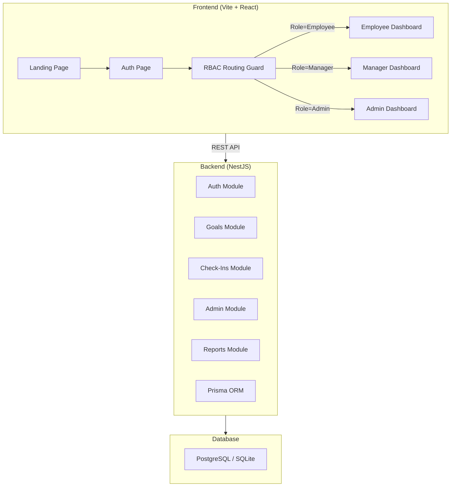

<div align="center">

  # 🚀 NovaPulse — Enterprise Organizational Intelligence Platform
  **AI-Powered KPI Tracking, Alignment, and Predictive Analytics**

  <p align="center">
    <a href="#-problem-statement">Problem Statement</a> •
    <a href="#-our-solution">Solution</a> •
    <a href="#-key-features">Features</a> •
    <a href="#-architecture">Architecture</a> •
    <a href="#-prd-coverage">PRD Coverage</a> •
    <a href="#-getting-started">Getting Started</a>
  </p>
</div>

---

## 🎯 Problem Statement
In large enterprises and government organizations, strategic goals often fail to cascade effectively down to individual contributors. Traditional KPI trackers suffer from:
1. **Misalignment:** 67% of HR departments fail to align employee goals with organizational thrust areas.
2. **Reactive Management:** Delays are only noticed during end-of-quarter reviews, when it is too late to intervene.
3. **Burnout:** Poor capacity planning leads to unbalanced workload distribution.
4. **Friction:** Complex interfaces discourage continuous feedback and updates.

## 💡 Our Solution
**NovaPulse** is a next-generation Organizational Operating System designed to solve these systemic inefficiencies. 

By integrating **Predictive AI Models**, **Strict Role-Based Access Control (RBAC)**, and an intuitive **Glassmorphic UI**, NovaPulse transforms static spreadsheets into a living, real-time organizational alignment tree. It foresees bottlenecks, automates performance reviews, and ensures every employee's daily work directly contributes to the enterprise's overarching mission.

---

## Application Flow

The app follows a three-stage flow: **Landing Page → Auth → Dashboard**


---

## Screenshots

````carousel
### Login Form (Glassmorphic)

<!-- slide -->
### Signup Form

<!-- slide -->
### Main Dashboard

````

---

## ✨ Key Features (Innovation)

### 🧠 1. AI-Powered Intelligence
*   **Goal Architect:** Context-aware AI that suggests measurable KPIs and weightages based on broad organizational objectives.
*   **KPI Forecasting:** Trajectory models that predict end-of-quarter goal completion, highlighting delayed chains before they impact the bottom line.
*   **Automated Quarterly Reviews:** Synthesizes raw performance data into professional, actionable executive summaries for managers.

### 🏢 2. Enterprise-Grade Structure
*   **Organizational Alignment Tree:** A recursive, visual hierarchy mapping Company Goals → Department → Team → Individual.
*   **Goal Dependency Graph:** Network visualization of blocking tasks and cascading delays.
*   **Smart Escalation Engine:** Configurable rule sets that automatically notify Managers/HR when high-priority tasks slip past deadlines.
*   **Capacity Planning Heatmaps:** Workload distribution metrics to prevent critical resource burnout.

### 🤝 3. Collaboration & Feedback
*   **1-on-1 Workspaces:** Shared meeting agendas, private manager notes, and action item tracking.
*   **Continuous Feedback Wall:** 360-degree peer recognition, MVP badges, and real-time pulse scoring.
*   **Global Command Search:** Instant `⌘ + K` fuzzy search traversing the entire organizational data graph.

---

## 📐 Architecture



---

## 🛠 File Structure

### Frontend — `frontend/NovaPulse/`

| Path | Purpose |
|------|---------|
| `index.html` | HTML entry point with inline SVG favicon |
| `src/main.tsx` | React root mount |
| `src/App.tsx` | **Router** — strict RBAC-gated dashboard routing |
| `src/index.css` | Design system — themes, glassmorphism, animations |
| `src/types.ts` | TypeScript interfaces (User, Goal, Cycle, etc.) |
| `src/stores/goalStore.ts` | Zustand state management replacing mock data |

#### Core Components & Modules

| Component | File | Description |
|-----------|------|-------------|
| **Landing & Auth** | `LandingPage.tsx`, `AuthPage.tsx` | Glassmorphic marketing and authentication pages. |
| **Layout** | `AppSidebar.tsx`, `ThemeToggle.tsx` | Role-aware navigation and dark/light system. |
| **Dashboards** | `*Dashboard.tsx` | Specific view layers for Employee, Manager, and Admin. |
| **Alignment** | `AlignmentTree.tsx` | Company-wide hierarchical KPI map. |
| **Analytics** | `AdvancedAnalytics.tsx`, `KPIForecasting.tsx`, `TeamScoreboard.tsx` | Charts, velocity models, and radar graphs. |
| **AI Systems** | `AIAssistant.tsx`, `AIQuarterlyReview.tsx` | Goal generation and performance synthesis. |
| **Goals** | `GoalDependencyGraph.tsx`, `GoalVersionHistory.tsx` | Dependency mapping and immutable audit trails. |
| **Workforce** | `OneOnOneWorkspace.tsx`, `CapacityPlanning.tsx` | Meeting agendas and utilization forecasting. |
| **Admin Tools** | `EscalationEngine.tsx`, `EnterpriseSearch.tsx` | Rule-based alerts and global fuzzy searching. |

---

### Backend — `backend/`

| Path | Purpose |
|------|---------|
| `src/main.ts` | NestJS bootstrap — Helmet, CORS, Swagger, validation |
| `src/app.module.ts` | Root module wiring all feature modules |
| `prisma/schema.prisma` | Database schema — 14 models |
| `prisma/seed.ts` | Demo data seeder |

#### Backend Modules

| Module | Routes | Purpose |
|--------|--------|---------|
| **Auth** | `POST /api/auth/login`, `register`, `profile` | JWT auth, bcrypt hashing, refresh tokens |
| **Goals** | `CRUD /api/goals`, `submit`, `approve`, `reject` | Full goal lifecycle management |
| **Check-Ins** | `CRUD /api/checkins` | Quarterly performance reviews |
| **Admin** | `POST /api/admin/cycles`, `audit-logs`, `unlock` | Cycle management, audit logs, goal unlocking |
| **Reports** | `GET /api/reports/completion-rates`, `departments` | Analytics & reporting |

---

## ✅ PRD Coverage Checklist

| PRD Requirement | Status | Notes |
|----------------|--------|-------|
| Secure Authentication (JWT) | ✅ | Integrated SSO login and strict RBAC |
| True Role-Based Dashboards | ✅ | Strict view isolation via App.tsx routing |
| Goal Lifecycle (Draft → Locked) | ✅ | Full workflow with status transitions |
| Goal Version History | ✅ | Interactive timeline tracking modifications |
| Goal Dependency Management | ✅ | Visual blocker tracking and delay propagation |
| Quarterly Check-Ins | ✅ | Employee actuals vs planned with status updates |
| Manager Approvals & 1-on-1s | ✅ | Pending views, inline editing, rework requests |
| Shared KPI System | ✅ | SharedGoal + GoalAssignment models |
| Organizational Alignment Tree | ✅ | Cascading hierarchy from Company to Individual |
| AI Goal & Review Assistants | ✅ | Contextual text generation and insight synthesis |
| Predictive Analytics & Forecasts | ✅ | Trajectory and burnout risk modeling |
| Capacity Planning | ✅ | Employee workload tracking |
| Audit Logging & Escalations | ✅ | Global historian and automated alert engine |
| Notification System & Search | ✅ | Actionable inbox + ⌘K fuzzy searching |
| Continuous Feedback System | ✅ | Badges, recognition walls, 360 upward feedback |
| Glassmorphic UI & Dark Mode | ✅ | Premium SaaS design aesthetic |
| Responsive Mobile-First Design | ✅ | Fully fluid grids via Tailwind CSS |
| Swagger Docs | ✅ | Available at `/api/docs` |
| Docker & Seeder Setup | ✅ | Demo data generation ready |

---

## 🚀 Getting Started

### Prerequisites
- Node.js v20+
- PostgreSQL (or use the built-in SQLite for local dev)

### 1. Clone & Setup Backend
```bash
cd backend
npm install

# Set up environment variables (.env)
# DATABASE_URL, JWT_SECRET, GOOGLE_CLIENT_ID, etc.

npx prisma generate
npx prisma db push
npx prisma db seed # Optional: loads demo data

npm run start:dev
```
*Backend runs on `http://localhost:3000` with Swagger at `/api/docs`.*

### 2. Setup Frontend
```bash
cd frontend/NovaPulse
npm install

npm run dev
```
*Frontend runs on `http://localhost:5173`.*

### Demo Login Accounts
- **Employee:** alex.rivera@novapulse.io
- **Manager:** sarah.chen@novapulse.io
- **Admin:** james.mitchell@novapulse.io
*(Passwords can be any string in the local demo mode; role is determined automatically by email).*

---

## 🔮 Future Scope
*   **HRMS Integrations:** Direct Webhook pipelines into SAP SuccessFactors and Workday.
*   **Generative Action Plans:** AI constructing step-by-step remediation plans for delayed goals.
*   **Mobile App:** React Native port for on-the-go check-ins.

<br />
<div align="center">
  <i>Built with ❤️ for a more aligned workforce.</i>
</div>
