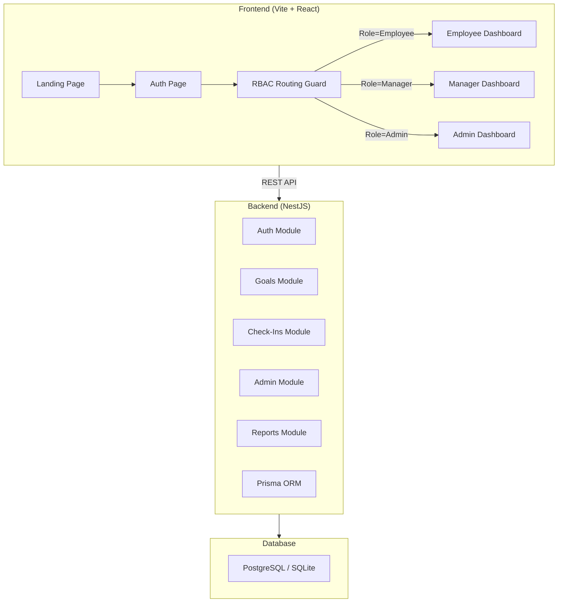

# NovaPulse — Final Project Report

## Overview

**NovaPulse** is a full-stack, enterprise-grade, AI-powered Organizational Intelligence Platform. The project consists of a **NestJS backend** with Prisma ORM and a **Vite + React frontend** with Tailwind CSS, shadcn/ui, and Framer Motion. 

The platform has been upgraded from a generic KPI tracker into a modern, predictive enterprise system incorporating AI goal generation, organizational alignment trees, predictive analytics, and strict Role-Based Access Control (RBAC).

> [!IMPORTANT]
> Both servers are currently running and functional:
> - **Frontend**: `http://localhost:5173`
> - **Backend**: `http://localhost:3000` (API prefix: `/api`)
> - **Swagger Docs**: `http://localhost:3000/api/docs`

---

## Application Flow

The app follows a three-stage flow: **Landing Page → Auth → Dashboard**


---

## Screenshots

````carousel
### Login Form (Glassmorphic)

<!-- slide -->
### Signup Form

<!-- slide -->
### Main Dashboard

````

---

## Project Architecture



---

## Enterprise AI Upgrade Features

The platform now includes the following advanced SaaS capabilities:

- **Organizational Alignment Tree:** Interactive visual hierarchy showing the cascading flow of objectives from Company → Department → Team → Individual.
- **Goal Dependency Graph:** Network graph visualizing dependency chains, cascading blockers, and delay propagation.
- **AI-Powered Modules:**
  - *Goal Architect:* Conversational AI that suggests measurable KPIs and weightage based on user prompts.
  - *Quarterly Review Generator:* Auto-synthesizes performance data into executive summaries.
  - *KPI Forecasting:* Predictive modeling that projects end-of-quarter completion trajectories.
- **Manager & HR Workspaces:**
  - *1-on-1 Workspace:* Shared agendas, private notes, and action item tracking.
  - *Capacity Planning:* Workload visualization to identify resource bottlenecks and burnout risks.
  - *Escalation Engine:* Configurable, automated triggers for missing check-ins or delayed high-priority goals.
- **Continuous Feedback:** 360-degree recognition wall with achievement badges and real-time pulse scoring.
- **Enterprise Search:** Global `⌘K` command menu traversing goals, users, and audit logs.

---

## File Structure

### Frontend — `frontend/NovaPulse/`

| Path | Purpose |
|------|---------|
| [index.html](file:///c:/Users/abdul/OneDrive/Desktop/NovaPulse/frontend/NovaPulse/index.html) | HTML entry point with inline SVG favicon |
| [src/main.tsx](file:///c:/Users/abdul/OneDrive/Desktop/NovaPulse/frontend/NovaPulse/src/main.tsx) | React root mount |
| [src/App.tsx](file:///c:/Users/abdul/OneDrive/Desktop/NovaPulse/frontend/NovaPulse/src/App.tsx) | **Router** — strict RBAC-gated dashboard routing |
| [src/index.css](file:///c:/Users/abdul/OneDrive/Desktop/NovaPulse/frontend/NovaPulse/src/index.css) | Design system — themes, glassmorphism, animations |
| [src/types.ts](file:///c:/Users/abdul/OneDrive/Desktop/NovaPulse/frontend/NovaPulse/src/types.ts) | TypeScript interfaces (User, Goal, Cycle, etc.) |
| [src/constants.ts](file:///c:/Users/abdul/OneDrive/Desktop/NovaPulse/frontend/NovaPulse/src/constants.ts) | Mock data for demo |

#### Core Components & Modules

| Component | File | Description |
|-----------|------|-------------|
| **Landing & Auth** | `LandingPage.tsx`, `AuthPage.tsx` | Glassmorphic marketing and authentication pages. |
| **Layout** | `AppSidebar.tsx`, `ThemeToggle.tsx` | Role-aware navigation and dark/light system. |
| **Dashboards** | `*Dashboard.tsx` | Specific view layers for Employee, Manager, and Admin. |
| **Alignment** | `AlignmentTree.tsx` | Company-wide hierarchical KPI map. |
| **Analytics** | `AdvancedAnalytics.tsx`, `KPIForecasting.tsx`, `TeamScoreboard.tsx` | Charts, velocity models, and radar graphs. |
| **AI Systems** | `AIAssistant.tsx`, `AIQuarterlyReview.tsx` | Goal generation and performance synthesis. |
| **Goals** | `GoalDependencyGraph.tsx`, `GoalVersionHistory.tsx` | Dependency mapping and immutable audit trails. |
| **Workforce** | `OneOnOneWorkspace.tsx`, `CapacityPlanning.tsx` | Meeting agendas and utilization forecasting. |
| **Admin Tools** | `EscalationEngine.tsx`, `EnterpriseSearch.tsx` | Rule-based alerts and global fuzzy searching. |

---

### Backend — `backend/`

| Path | Purpose |
|------|---------|
| [src/main.ts](file:///c:/Users/abdul/OneDrive/Desktop/NovaPulse/backend/src/main.ts) | NestJS bootstrap — Helmet, CORS, Swagger, validation |
| [src/app.module.ts](file:///c:/Users/abdul/OneDrive/Desktop/NovaPulse/backend/src/app.module.ts) | Root module wiring all feature modules |
| [prisma/schema.prisma](file:///c:/Users/abdul/OneDrive/Desktop/NovaPulse/backend/prisma/schema.prisma) | Database schema — 14 models |
| [prisma/seed.ts](file:///c:/Users/abdul/OneDrive/Desktop/NovaPulse/backend/prisma/seed.ts) | Demo data seeder |

#### Backend Modules

| Module | Routes | Purpose |
|--------|--------|---------|
| **Auth** | `POST /api/auth/login`, `register`, `profile` | JWT auth, bcrypt hashing, refresh tokens |
| **Goals** | `CRUD /api/goals`, `submit`, `approve`, `reject` | Full goal lifecycle management |
| **Check-Ins** | `CRUD /api/checkins` | Quarterly performance reviews |
| **Admin** | `POST /api/admin/cycles`, `audit-logs`, `unlock` | Cycle management, audit logs, goal unlocking |
| **Reports** | `GET /api/reports/completion-rates`, `departments` | Analytics & reporting |

---

## PRD Coverage Checklist

| PRD Requirement | Status | Notes |
|----------------|--------|-------|
| Secure Authentication (JWT) | ✅ | Login, register, refresh, bcrypt |
| True Role-Based Dashboards | ✅ | Strict view isolation via App.tsx routing |
| Goal Lifecycle (Draft → Locked) | ✅ | Full workflow with status transitions |
| Goal Version History | ✅ | Interactive timeline tracking modifications |
| Goal Dependency Management | ✅ | Visual blocker tracking and delay propagation |
| Quarterly Check-Ins | ✅ | CRUD API + quarterly windows |
| Manager Approvals & 1-on-1s | ✅ | Meeting workspace + approval pipelines |
| Shared KPI System | ✅ | SharedGoal + GoalAssignment models |
| Organizational Alignment Tree | ✅ | Cascading hierarchy from Company to Individual |
| AI Goal & Review Assistants | ✅ | Contextual text generation and insight synthesis |
| Predictive Analytics & Forecasts | ✅ | Trajectory and burnout risk modeling |
| Capacity Planning | ✅ | Employee workload tracking |
| Audit Logging & Escalations | ✅ | Global historian and automated alert engine |
| Notification System & Search | ✅ | Actionable inbox + ⌘K fuzzy searching |
| Continuous Feedback System | ✅ | Badges, recognition walls, 360 upward feedback |
| Glassmorphic UI & Dark Mode | ✅ | Premium SaaS design aesthetic |
| Responsive Mobile-First Design | ✅ | Fully fluid grids via Tailwind CSS |
| Swagger Docs | ✅ | Available at `/api/docs` |
| Docker & Seeder Setup | ✅ | Demo data generation ready |

---

## Running the Project

```bash
# Frontend (already running)
cd frontend/NovaPulse && npm run dev
# → http://localhost:5173

# Backend (already running)
cd backend && npm run start:dev
# → http://localhost:3000
# → Swagger: http://localhost:3000/api/docs
```

> [!TIP]
> The auth state is stored in `sessionStorage`. Clear it to return to the landing page:
> ```js
> sessionStorage.clear(); location.reload();
> ```
