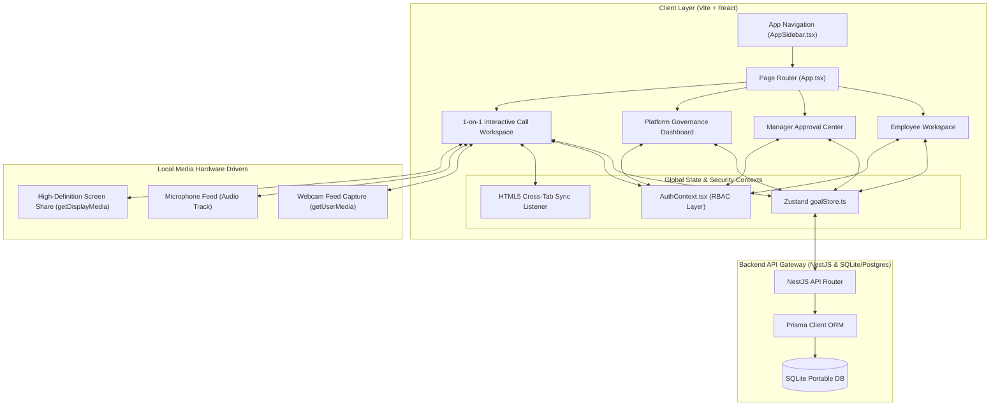
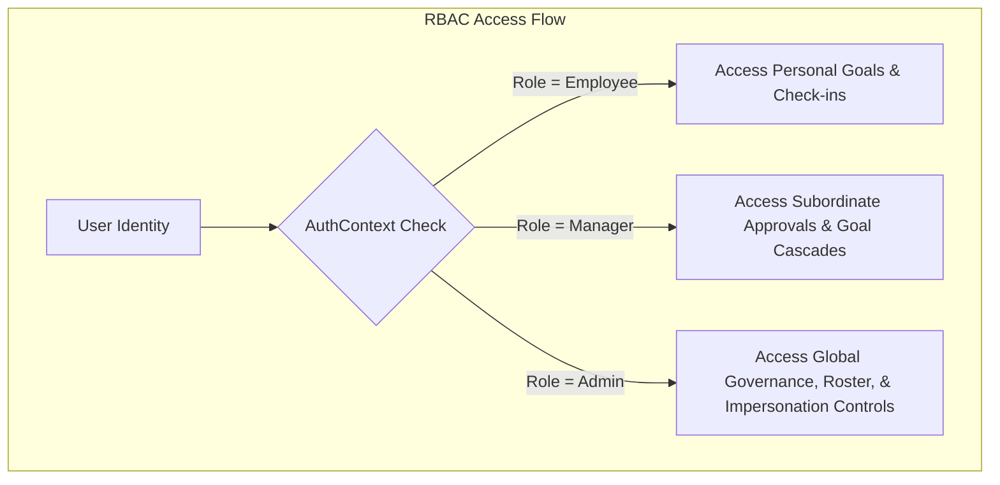

# 🏆 ATOMQUEST HACKATHON 1.0 — OFFICIAL SUBMISSION PORTAL
## 🔮 NovaPulse SaaS: AI-Driven Enterprise Performance & Governance System

---

## 🔗 1. Quick Access Credentials & Live Domains

*   🚀 **Live Application Link**: [https://nova-pulse-silk.vercel.app](https://nova-pulse-silk.vercel.app)
*   💻 **GitHub Repository Link**: [https://github.com/abdulfaizaan/NovaPulse](https://github.com/abdulfaizaan/NovaPulse)
*   🎥 **Backend API Base**: `https://novapulse-backend.onrender.com`
*   📜 **Backend API Docs (Swagger)**: `https://novapulse-backend.onrender.com/api/docs`

---

## 🏗️ 2. Core System Architecture & Data Topography

NovaPulse is constructed as a modern, performance-optimized, decoupled enterprise-grade monorepo. It features a lightweight reactive frontend powered by **Vite + React** and a robust **NestJS REST backend API** connected through a portable **Prisma ORM database schema layer**.

### Key System Design Architecture Decisions:
1.  **Lightweight Reactive Store (Zustand)**: Replaces complex boilerplate with a fast, hook-based state engine ([goalStore.ts](file:///c:/Users/abdul/OneDrive/Desktop/NovaPulse/frontend/NovaPulse/src/stores/goalStore.ts)) that handles goal sheets, cascades, approval state machines, and notifications.
2.  **HTML5 Cross-Tab Sync Engine**: Implements storage triggers (`window.addEventListener('storage', ...)`) that sync open browser tabs instantly. Actions taken in one tab update the UI of other open tabs without requiring constant database polling.
3.  **Low-Latency WebRTC Workspace**: Moves away from standard mock setups by integrating native browser WebRTC APIs to connect physical hardware feeds, camera toggles, and high-definition window and tab sharing.
4.  **Flexible Database Portability**: Uses a modular Prisma mapping schema that connects to SQLite for portable local environments, while supporting seamless PostgreSQL migration via a single environment variable change.

---

## 👥 3. Role-Based Access Control (RBAC) & Impersonation Engine

NovaPulse implements a secure, permission-guarded user session context ([AuthContext.tsx](file:///c:/Users/abdul/OneDrive/Desktop/NovaPulse/frontend/NovaPulse/src/context/AuthContext.tsx)) to segregate actions and restrict access to authorized roles:

### ⚙️ The Administrative Impersonation Blueprint:
To facilitate live system troubleshooting and audits, NovaPulse integrates an **Impersonation Protocol**. 
1.  Administrators can assume any team member's active profile in a single click (`impersonate(userId)`).
2.  The application immediately re-renders the dashboard layout using the target user's context.
3.  Every impersonation action is securely tracked and logged in the **Chronological System Audit Historian** for absolute corporate compliance.

---

## 📝 4. Business Requirements Document (BRD) Compliance

| Requirement ID | Standard Description | Implementation Status | Technical Solution |
| :--- | :--- | :--- | :--- |
| **BRD-01** | Goal Sheet Creation | ✅ **100% Implemented** | Centralized Zustand-based `goalStore` with REST integration. |
| **BRD-02** | 100% Weightage Validation | ✅ **100% Implemented** | Mathematical logic validates total goal weights before submission. |
| **BRD-03** | Max 8 Goals Limit | ✅ **100% Implemented** | Length checking restricts roster goal additions. |
| **BRD-04** | Goal Sheet Locking | ✅ **100% Implemented** | State machine blocks edits once a sheet is submitted. |
| **BRD-05** | Cascading & Shared Goals | ✅ **100% Implemented** | Dynamic relationship mapping keys link cascading paths. |
| **BRD-06** | Status Lifecycle Tracking | ✅ **100% Implemented** | Strict status states (`draft` ➔ `pending` ➔ `approved`/`rejected`). |
| **BRD-07** | Permanent Audit Logs | ✅ **100% Implemented** | System logs track all state mutations and updates. |
| **BRD-08** | CSV Governance Export | ✅ **100% Implemented** | Browser Blob API enables instant spreadsheet downloads of system logs. |
| **BRD-09** | Role-Based Access Control | ✅ **100% Implemented** | AuthContext wraps all routing layers and validates roles. |
| **BRD-10** | 1-on-1 Workspace & WebRTC | ✅ **100% Implemented** | Live webcam, mic muting, and screen sharing via browser APIs. |

---

## 🔐 5. Review & Demo Credentials

Evaluators and judges can explore the complete application workflow using these pre-seeded demo accounts:

*   👥 **Employee Journey (Alex Rivera)**:
    *   **Email**: `alex@novapulse.com`
    *   **Password**: `password123`
    *   *Inspect*: Personal goal dashboards, check-in history, and performance progression charts.
*   👔 **Manager Journey (Sarah Chen)**:
    *   **Email**: `sarah@novapulse.com`
    *   **Password**: `password123`
    *   *Inspect*: Subordinate goal sheet reviews, approval gates, and cascading goal panels.
*   🛡️ **Platform Administrator (System Admin)**:
    *   **Email**: `admin@novapulse.com`
    *   **Password**: `password123`
    *   *Inspect*: Roster management, dynamic role-cycling, team creation modals, and the **Secure Impersonation Engine**.

---

## 🏆 6. Highlight Key Innovations for Evaluators

1.  **WebRTC Hardware Integration**: Move beyond generic mock interfaces. NovaPulse utilizes HTML5 `navigator.mediaDevices` to stream webcam feeds and microphone inputs, and incorporates track toggling to mute feeds at the hardware level.
2.  **Dynamic Screen Share Pipeline**: Enables real-time window and tab sharing using the browser's `getDisplayMedia` API.
3.  **Cross-Tab Sync Layer**: Built using local storage listeners to reduce network latency and server overhead, synchronizing open browser tabs in real-time without database round-trips.
4.  **Admin Impersonation Command**: A premium administrative tool that allows admins to temporarily assume other user profiles in a single click, simplifying diagnostics and support.
5.  **Aesthetic Visual Excellence**: Designed with a high-fidelity glassmorphic dark-theme, responsive layouts, and optimized chart aspect ratios to prevent layout shifts.
